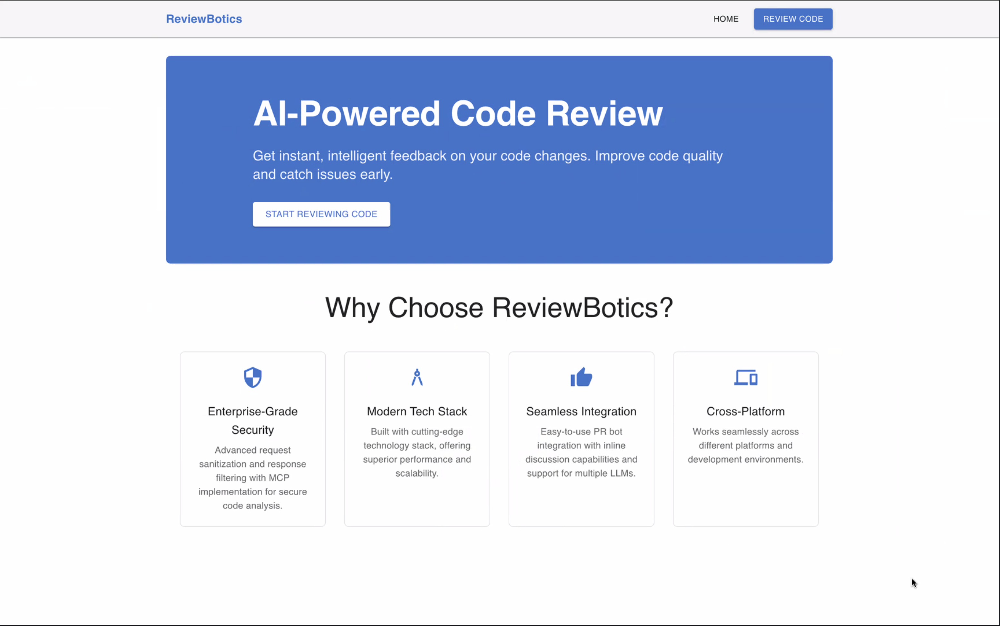

# AI Code Review Assistant

## 🚀 Project Overview

AI Code Review Assistant is a cross-platform, AI-powered solution that automatically reviews pull requests for logic correctness, security vulnerabilities, performance bottlenecks, and best practices. It integrates seamlessly with popular git platforms and provides actionable, inline feedback to developers, improving code quality and accelerating the review process.

## 🏗️ Architecture

The solution consists of a modern React frontend and a robust Spring Boot backend. The frontend provides an intuitive UI for submitting PRs and viewing feedback, while the backend handles integration with git providers, invokes LLMs for code analysis, and manages security and context.

```
[User]
   ⇅
[React Frontend]  ⇄  [Spring Boot Backend]  ⇄  [OpenAI API/LLMs]
                                 ⇅
                        [GitHub/GitLab/Bitbucket]
```
- **Frontend**: React + Material-UI, secure PR submission, instant feedback, cross-platform support
- **Backend**: Spring Boot, handles git integration, request sanitization, LLM orchestration, and response filtering
- **LLM**: Multiple LLMs supported for code review intelligence
- **Security**: All requests are sanitized and responses filtered; code never leaves your environment

## 🖼️ UI Page Screenshots

> _Replace the image paths with your actual screenshot files in the repo (e.g., `/screenshots/home.png`)._

### Home Screen

*Landing page highlighting features and call-to-action.*

### In Progress

*Shows loading or review in progress state after submitting a PR URL.*

### Review Page

*Paste a PR URL, view instant AI-powered review feedback, and see inline suggestions.*

### Review Result Expanded

*Expanded view of detailed review results and inline comments.*

### Error Page

*Displays error messages, such as failed to review PR or invalid PR URL.*

---

## Features

- Integrates with GitHub/GitLab/Bitbucket
- Auto-reviews pull requests for:
  - Logic correctness
  - Security vulnerabilities
  - Performance bottlenecks
  - Style and best practices
- Understands project-specific context
- Leaves actionable comments directly on PR lines
- Suggests:
  - Missing unit/integration tests
  - Documentation updates
  - Refactoring opportunities

## Tech Stack

- Frontend: React + Material-UI
- Backend: Spring Boot (Java)
- Git Integration: GitHub Webhooks & GitHub REST API
- AI Engine: OpenAI API (with support for multiple LLMs)
- Project Context: YAML/JSON configuration

## Prerequisites

- Java 17 or higher
- Maven
- OpenAI API key
- GitHub App credentials